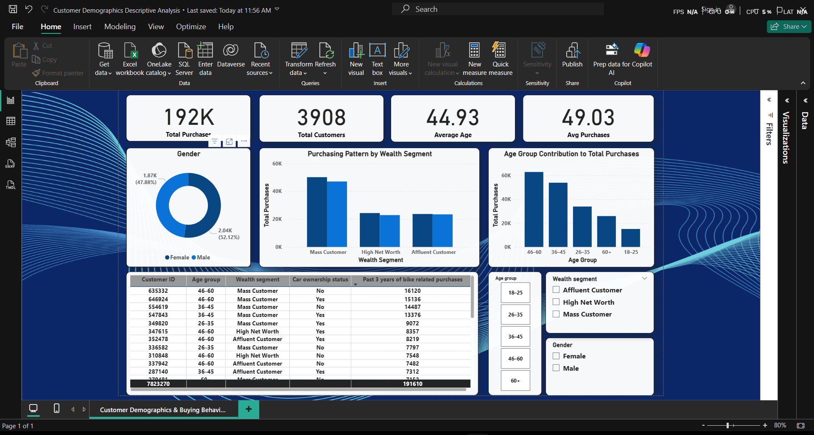

# 🧠 Customer Demographics Analysis (Power BI)

## 📌 Problem Statement  
The goal of this project is to analyze customer demographics to uncover **key trends in age, gender, income (wealth segment)**, and **buying behavior**.  
This analysis helps understand which customer groups contribute the most to overall purchases and how demographic factors influence purchasing patterns.

---

## 📂 Data Source  
Dataset: [KPMG Customer Demography Dataset](https://www.kaggle.com/datasets)  
File Used: `KPMG_Customer_Demography.csv`  
- Columns include: `customer_id`, `gender`, `age`, `wealth_segment`, `owns_car`, `past_3_years_bike_related_purchases`, etc.  
- Data cleaning and summarization performed using **Python (Pandas)** before visualization in **Power BI**.

---

## ⚙️ Approach  

### 1. Data Preparation (Python)
- Loaded and cleaned raw data  
- Handled missing values and outliers  
- Created new columns (`age_group`) for better segmentation  
- Saved cleaned data as `customer_summary.csv` for Power BI

### 2. Power BI Data Modeling
- Imported the CSV into Power BI Desktop  
- Created DAX measures for:  
  - Total Purchases  
  - Total Customers  
  - Average Age  
  - Avg Purchases per Customer  
  - Gender Ratios  
  - Age Group % of Total Purchases  

### 3. Visualization & Dashboard Design
- Designed a clean and minimal dashboard with KPIs, charts, and filters  
- Visual types:
  - **Cards** for KPIs  
  - **Donut Chart** for Gender distribution  
  - **Clustered Column Chart** for Wealth Segment purchases  
  - **Bar Chart** for Age Group contributions  
  - **Table** for detailed customer summaries  

---

## 📈 Key Findings  
- Customers aged **26–35 years** are the most active buyers.  
- **High-Net-Worth individuals** account for the largest portion of total purchases.  
- **Males** make slightly more purchases than females.  
- Customers who **own cars** tend to have higher average purchases.  

---

## 📊 Visuals  

### Power BI Dashboard Preview  

---

## 🧩 Skills & Tools Used  
- **Python** (Data Cleaning, Descriptive Statistics, Summarization)  
- **Power BI** (DAX, Dashboard Design, Data Modeling)  
- **Pandas, NumPy, Matplotlib** (Data preprocessing)  
- **Business Intelligence** and **Descriptive Analytics**

---

## 🏁 Outcome  
The project provides actionable insights into customer segments, enabling data-driven decision-making for targeted marketing and better customer engagement strategies.
